# Image Orientation Classification
- Image orientation classification using given vectorized 192 pixels of the image.

### Using Neural Network
- Normalized data by dividing each pixel value with 255 so that all feature values are between 0 and 1
- Instead of using for loops to calculate values at each neuron, doing matrix multiplication for quick calculations.
- Therefore weights are saved in a 2d numpy array
- Each weight matrix has a dimension of (#neurons in previous layer X #neurons in next layer)
- Intialized weights by random values following normal distribution and dividing them by square root of 1 over #neurons in input layer which is a Xaviers initializer

- Model Architecture used:
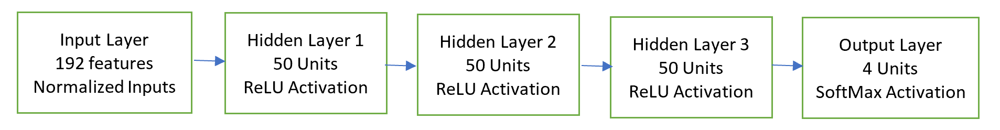
Epochs = 20, Learning rate = 0.005

- Using above model architecture, did stochastic gradient descent to update the weights
- Best model is picked based on high validation accuracy after all epochs
- Final model accuracy is about 78% on train data, validation and about 76% on test data
- Time taken by the best model to run is little over 3 minutes
- Various experiments performed:
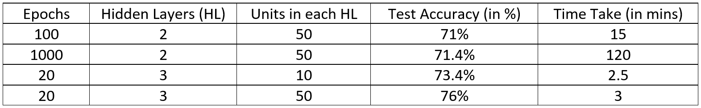

### KNN
- KNN has two parameters:
  - K – Number of nearest neighbors.
  - Distance function ( Euclidean and Manhattan )
- We have experimented with K values from 1 to 15 for both distance functions. And 
- Got better results with Euclidean Distance over Manhattan (as Euclidian is true distance between points.)
- Highest accuracy when K = 11 (But accuracy did not vary much for K values greater than 4. 
- Runtime for all the K-values is almost similar because major part of time is taken for calculating distances.

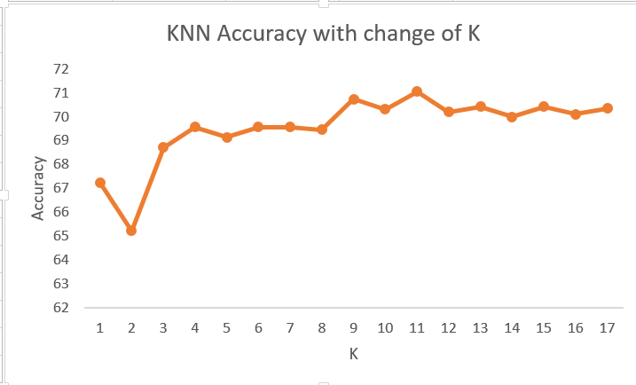
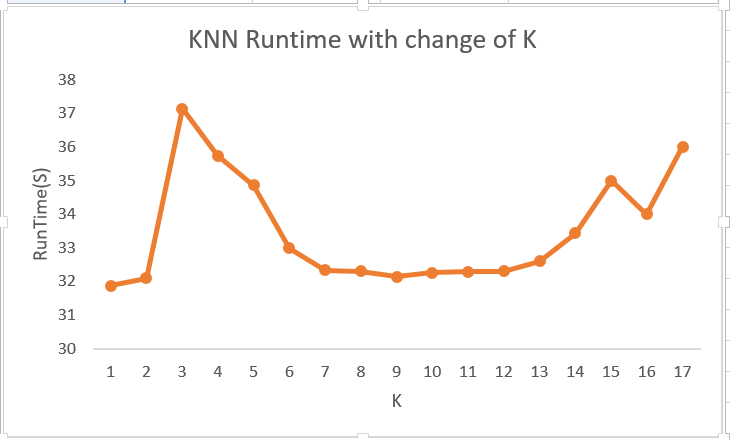

### Decision Tree:
- Algorithm:
  - Used ID3 algorithm with Entropy function and Information gain as metrics.
  - Find the best split value for all the attributes i.e. with max information gain. To reduce run time we have considered 5 random cutoffs between 0 to 255.
  - Based on that, find the attribute that has the maximum information gain by finding the change in entropy due to split. And save it in the Tree
  - Now as per the split, separate the dataset into two parts - Left and Right and then recursively find the attribute with maximum gain with repeating the steps above.
  - At the end of the recursion we will have the model built with leaf nodes representing the class variables - ‘0’, ‘90’, ‘180’, ‘270’
  - After the tree is built, we save the tree in “tree_model.txt” file using pickle package.
- Parameters
  - K – Maximum depth of the tree.
  - Number of thresholds values to check for each attribute.
 
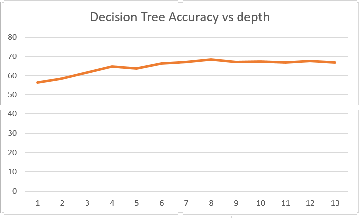
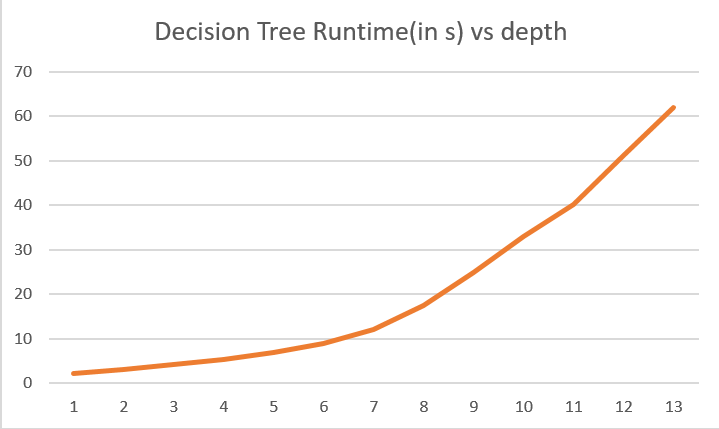

- Error analysis: Image classification is failing for all the 3 classifiers when (Below are few misclassified examples)
  - Images are mostly natural
  - Images are taken from the ariel view
  - Images are symmetric
  - Interestingly 3rd image of 180 degree rotated is already a mirror image because of water (Fig i)

| | | |
|:-------------------------:|:-------------------------:|:-------------------------:|
|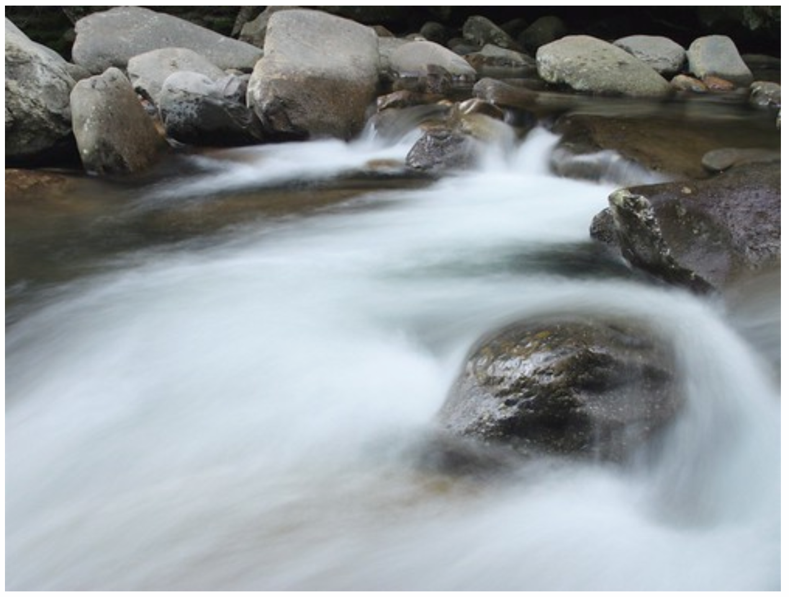 Fig a: Error when rotated 0 degrees |  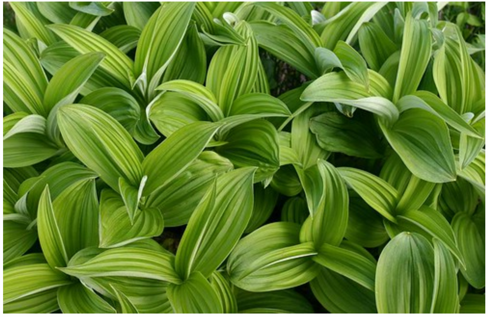Fig b: Error when rotated 0 degrees|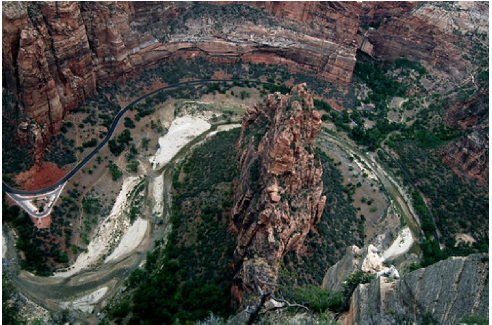Fig c: Error when rotated 0 degrees|
|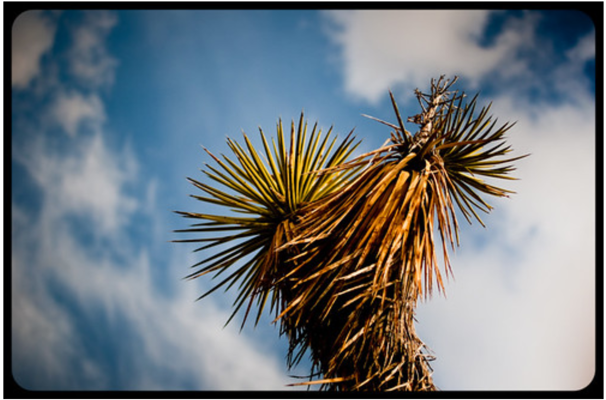  Fig d: Error when rotated 90 degrees|  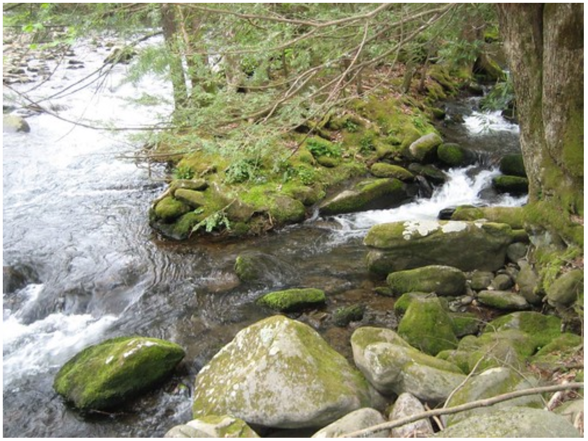Fig e: Error when rotated 90 degrees|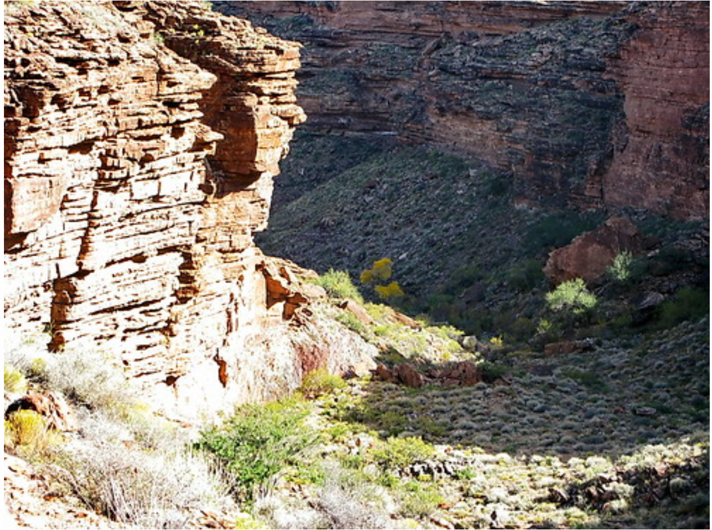Fig f: Error when rotated 90 degrees|
|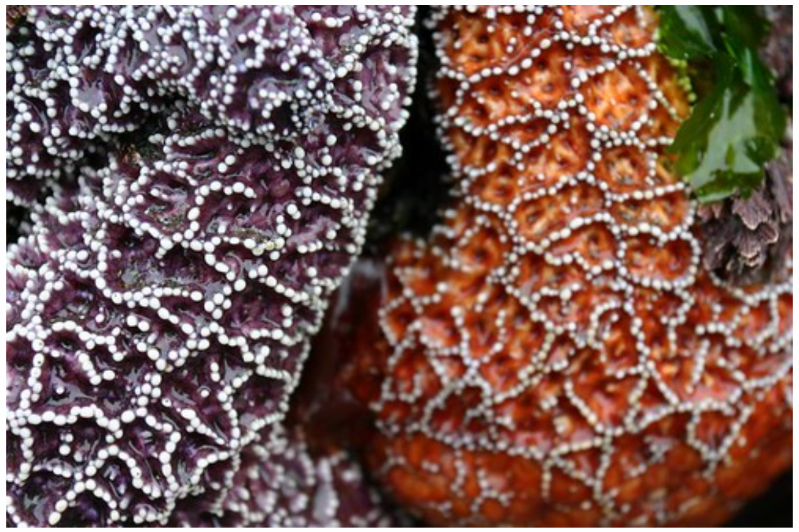  Fig g: Error when rotated 180 degrees|  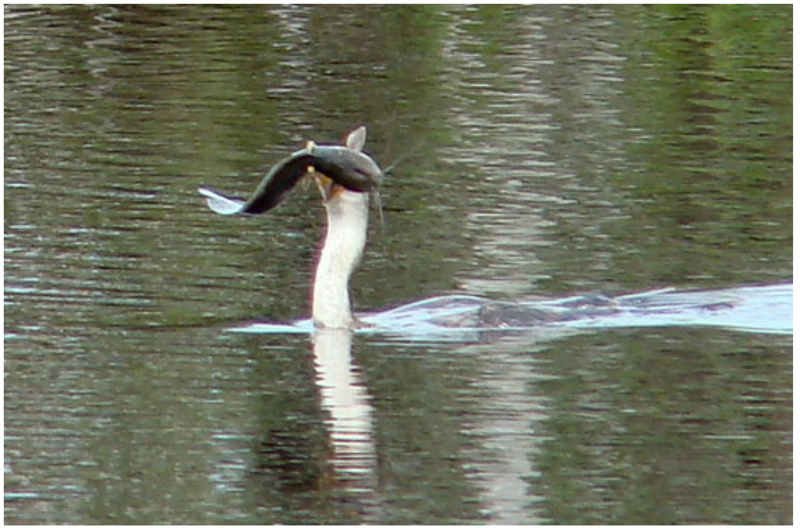Fig h: Error when rotated 180 degrees|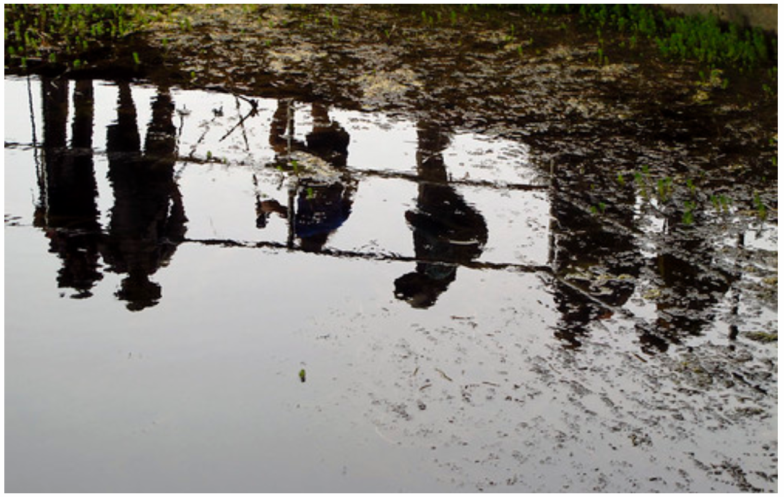Fig i: Error when rotated 180 degrees|
|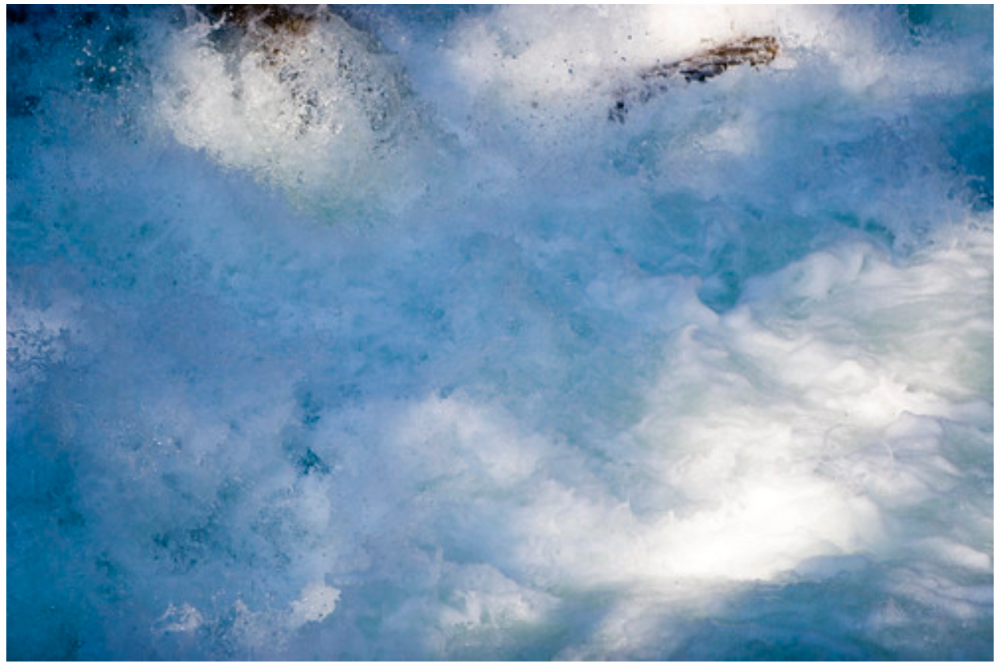  Fig j: Error when rotated 270 degrees|  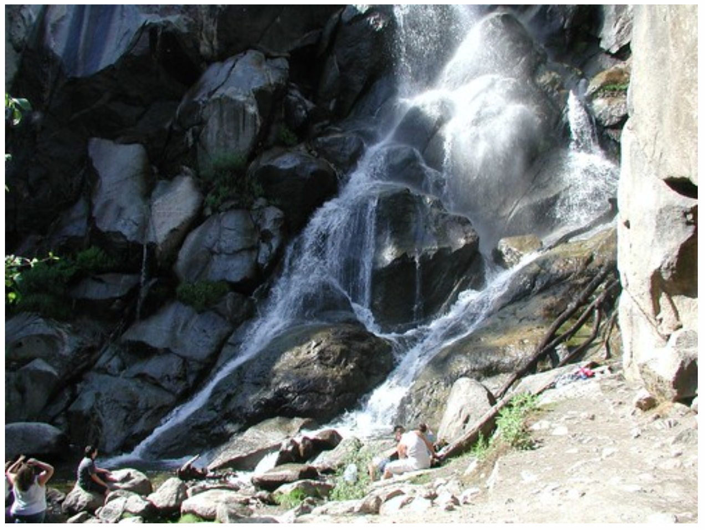Fig k: Error when rotated 270 degrees|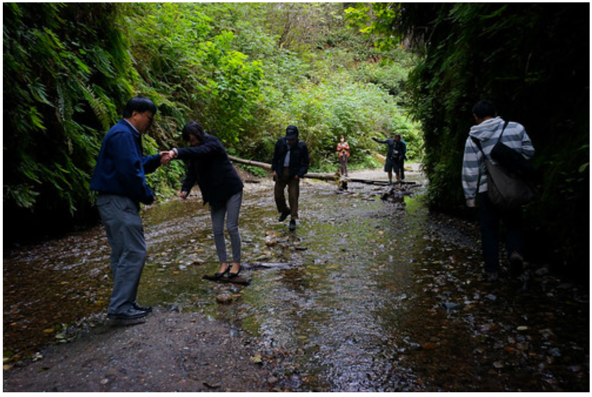Fig l: Error when rotated 270 degrees|

